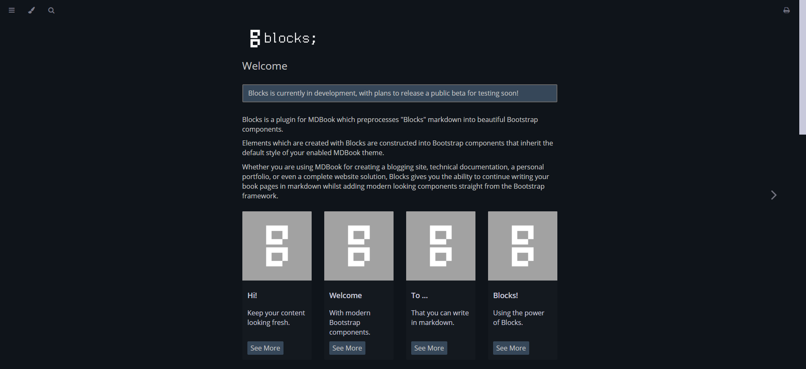

Blocks is a plugin for MDBook which preprocesses "Blocks" markdown into beautiful Bootstrap components.

Elements which are created with Blocks are constructed into Bootstrap components that inherit the default style of your enabled MDBook theme.

Whether you are using MDBook for creating a blogging site, technical documentation, a personal portfolio, or even a complete website solution, Blocks gives you the ability to continue writing your book pages in markdown whilst adding modern looking components straight from the Bootstrap framework.

